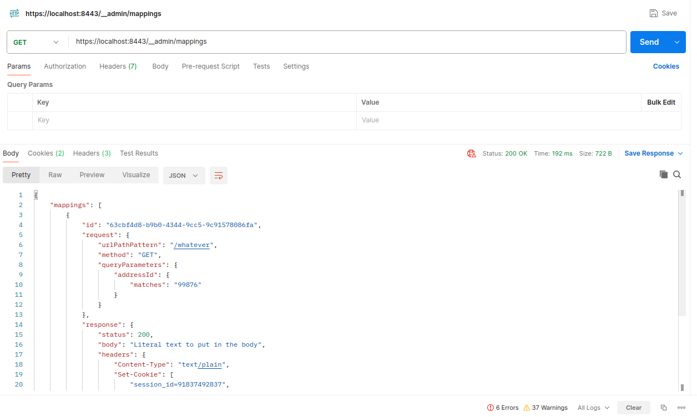

## https://wiremock.org/docs/stubbing/

## https://wiremock.org/docs/request-matching/

1\. Создаем рабочую папку

2\. В рабочей папке создаем файл json с нашей заглушкой (например whatever.json)

Содержание файла

```json
{
    "request": {
        "method": "GET", ## метод вызываемой заглушки
          "queryParameters" : { ## параметры запроса
             "addressId" : {
               "matches" : "99876" ## с чем должно совпадать   .* - вообще будет с чем угодно совпадать
          }
        },
        "urlPathPattern": "/whatever" ## !!! именно шаблон URL а не чистый URL !!!
    },
    "response": {
        "status": 200,
        "body": "Literal text to put in the body",
        "headers": {
            "Content-Type": "text/plain",
            "Set-Cookie": ["session_id=91837492837", "split_test_group=B"],
            "Cache-Control": "no-cache"
        }
    }
}
```

&nbsp;3. Там же создаем Dockerfile

```yaml
FROM wiremock/wiremock:3.12.1  ## версия может меняться
COPY whatever.json /home/wiremock/mappings/ ## файл из шага 2 - это рабочая директория WireMocka
```

4\. Собираем наш контейнер

```bash
sudo dockebuild . -t wiremock:v1.4
```

5\. Запускаем наш контейнер пробросив порты

```bash
sudo docker run -it --rm   -p 8443:8443   --name wiremock   wiremock:v1.4   --https-port 8443 --verbose

```

&nbsp;По умолчанию порты не пробрасываются !!!


Дополнительно можно пробрасывать и прочии параметры вызова

&nbsp;

6\. Идем в Postman и проверяем что все поднялось



7\. Проверяем нашу заглушку


8\. Если вдруг надо добавить еще заглушку - то вариант 1  - пересобрать все начиная с шага 2 - и это тогда будет на постоянной основе - декларативный вариант

Или вариант 2 - императивный - создать временную заглушку через API WIREMOCK

Пример заглушки

```JSON
{
  "request": {
    "method": "GET",
    "url": "/some/thing"
  },

  "response": {
    "status": 200,
    "body": "Hello, world!",
    "headers": {
        "Content-Type": "text/plain"
    }
  }
}
```

!!!! POST !!!!

## https://wiremock.org/docs/standalone/admin-api-reference/


9\. Также можно императивно править и удалять созданные заглушки

10\. Возврат пришедшего параметра в теле ответа


```json
{
    "request": {
        "method": "GET",
          "queryParameters" : {
             "addressId" : {
               "matches" : ".*"
          }
        },
        "urlPathPattern": "/whatever"
    },
    "response": {
        "status": 200,        
        "body": "{\"received-addressId\":\"{{request.requestLine.query.addressId}}\"}",

    "headers": {
      "Content-Type": "application/json"
    },
    "transformers": ["response-template"]
  }

}
```

11\. Создание заглушки с переменными

```bash
VALUE_1="Горностай"
VALUE_2="Stoat"
curl -k -X POST "https://localhost:8443/__admin/mappings" -H "Content-Type: application/json" -d '{
  "request": {
    "method": "GET",
    "url": "/some/thing"
  },


  "response": {
    "status": 200,
    "body": "{ \"message\": \"'"${VALUE_1}"' Hello, '"${VALUE_2}"'!\" }",
    "headers": {
      "Content-Type": "application/json"
    }
  
}}'
```

12\. Просмотр последних запросов

```bash
https://localhost:8443/__admin/requests
```

